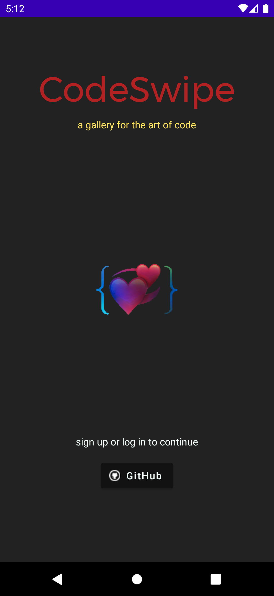
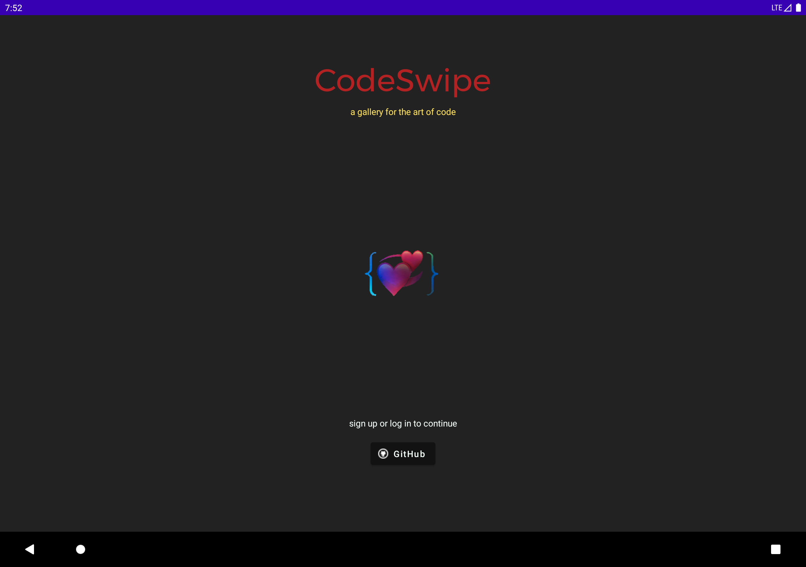
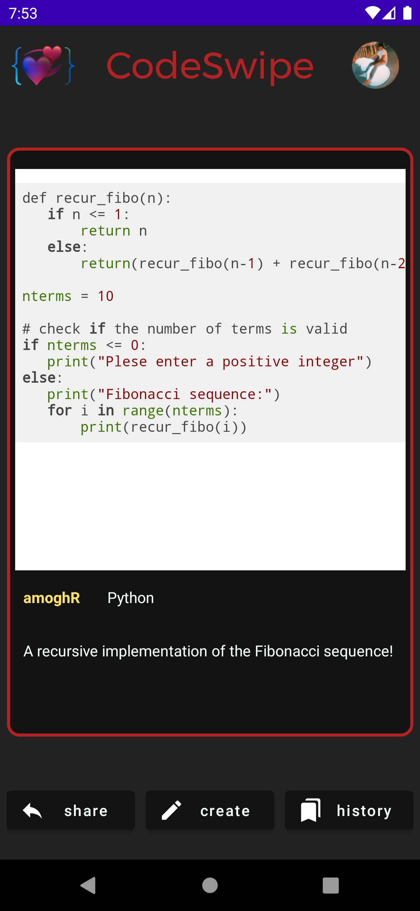
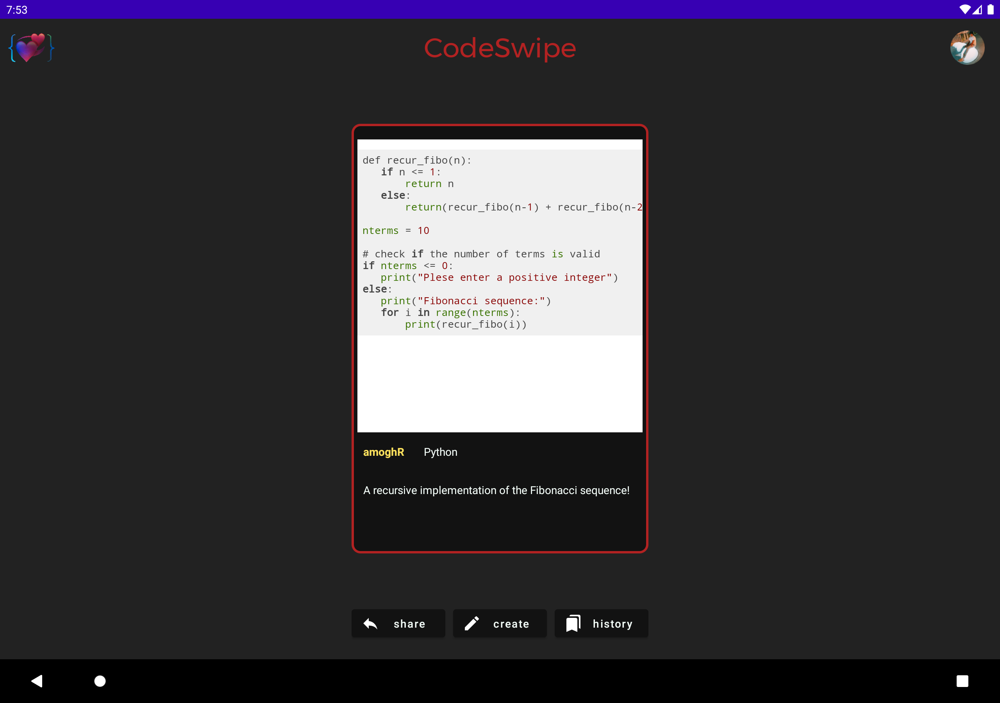
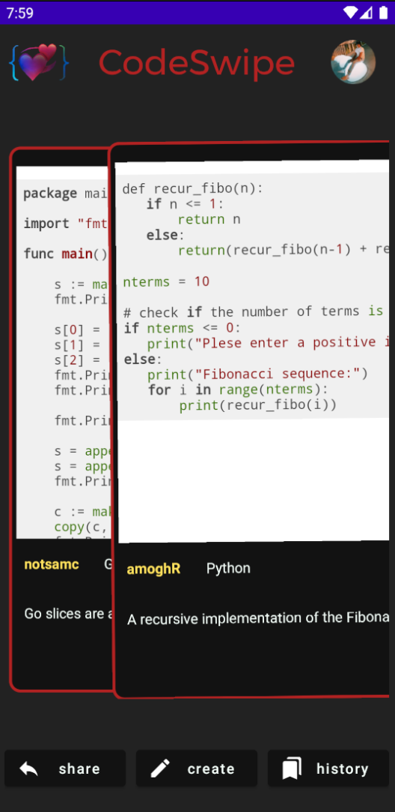
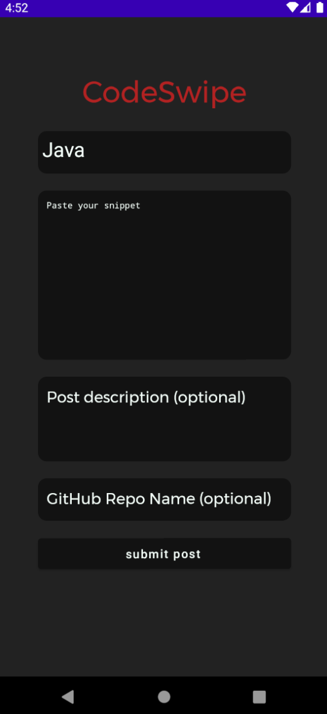
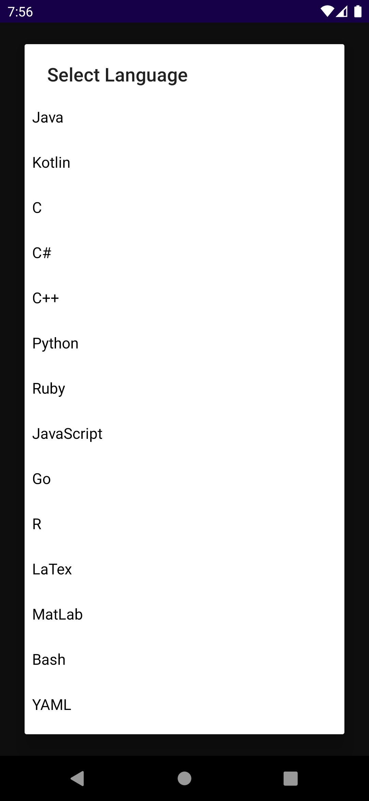
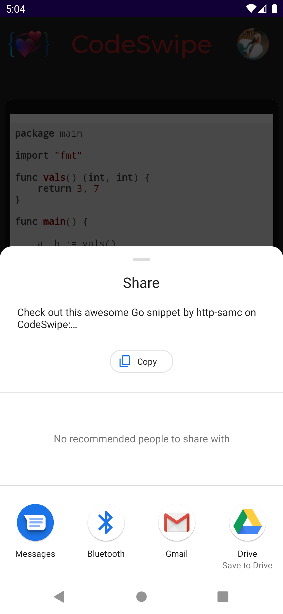
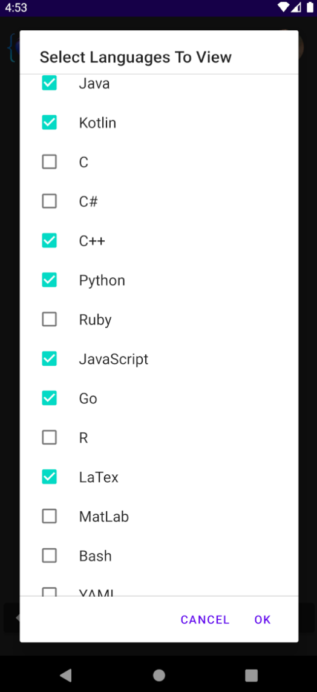

# CodeSwipe
a gallery for the art of code 💞

Every day, developers around the world push billions of commits, deliberate on millions of issues, and work tirelessly to create amazing projects that transform the world around them. Unfortunately, there’s rarely an easy way for them to garner appreciation for their code. Though the apps, APIs, and libraries they create are beautiful in and of themselves, coding is an art form and deserves its own gallery.

That’s why made CodeSwipe, the premier platform to share code snippets with other developers. Our target audience is developers of all ages looking to experience code in a new way. Users can ‘swipe’ on posts, with ‘liked’ posts showing up in their history. To create their own posts, users can paste in a code snippet, define a language, and add an (optional) description with an (optional) GitHub repository name.

## Functionality
View the original presentation [here](https://docs.google.com/presentation/d/1hbRp2vDYWBegtlSsMT9lSRWWYzY8sU5DWmXpRK2TjsQ/edit?usp=sharing).
- Sign up/Log in with Firebase GitHub Authentication
- Store posts within Firestore
- API calls to GitHub to follow users automatically and star their gists
- Supports multiple snippets for programming languages Appropriate syntax highlighting for all major languages
- Swipe support (with animation) to go to another post (Swipe right means the post is ‘liked’ and saved to history, swipe left skips)
- Toolbar with share functionality, create a new post, and history
- Users can filter languages they want to see
- New Post within the app:
    - You paste in a code snippet (150 lines max), define the language (for syntax highlighting), optional caption
    - When viewing your history, you can click the post to revisit the snippet in the browser
    - A GitHub Gist repository is automatically created with your snippet when you post

## UI
- Dark theme
- Scales well for phones and tablets
- Intuitive design

 

## Authors
1. [Samarth C.](https://github.com/http-samc)
2. [Kishan T.](https://github.com/KishanTeeka)
3. [Amogh R.](https://github.com/booghaa)
4. [Matthew P.L.](https://github.com/bilbaothanos6)